  

  

  
  
  
  

 

<h2 align="center">👨‍💻 Sobre mim</h2>

<table align="center">
  <tr>
    <td width="32%" align="center" valign="middle">
      
    </td>
    <td width="68%" valign="top">
      <h3>Olá, eu sou Dinicley Aguiar. 👋</h3>
      

        Professor, desenvolvedor Full Stack, gestor de tecnologia e profissional de comunicação digital,
        com experiência em desenvolvimento de sistemas, automações, infraestrutura e soluções digitais.
      

      

        Trabalho com aplicações web, APIs, sistemas desktop, ferramentas de produtividade,
        soluções comerciais, integrações, ambientes locais e projetos voltados para educação,
        empresas e serviços públicos.
      

      
🧩 Gosto de transformar problemas reais em ferramentas simples, organizadas, funcionais e prontas para evoluir.

      
📍 Bannach, Pará, Brasil.

    </td>
  </tr>
</table>

 

<h2 align="center">🚀 Tecnologias & stack</h2>

  

  
  
  
  
  
  
  
  

  PHP / Laravel • Node.js • TypeScript • Vue • React / Expo • C# / .NET • Rust / Tauri • Python •
  PostgreSQL • MySQL • Redis • SQLite • Docker • GitHub Actions • PowerShell • Linux

 

<h2 align="center">⭐ Projetos em destaque</h2>

<table>
  <tr>
    <td width="50%" valign="top">
      <h3>⏱️ <a href="https://github.com/dinicleyaguiar/DeskCron">DeskCron</a></h3>
      
Automação local-first para desenvolvedores usando workflows YAML, cron, shell, HTTP, Git, Ollama e notificações desktop.

      
 

    </td>
    <td width="50%" valign="top">
      <h3>🛡️ <a href="https://github.com/dinicleyaguiar/github-secutiry-scanner">GitHub Security Scanner</a></h3>
      
Ferramenta local em Python para localizar arquivos sensíveis, credenciais, chaves, tokens e configurações inseguras em repositórios Git.

      
 

    </td>
  </tr>
  <tr>
    <td width="50%" valign="top">
      <h3>🏛️ <a href="https://github.com/dinicleyaguiar/App-Vereadores-1.0">App Vereadores</a></h3>
      
Aplicação em tempo real para inscrição, sorteio e controle da ordem de fala em sessões legislativas.

      
 

    </td>
    <td width="50%" valign="top">
      <h3>🐘 <a href="https://github.com/dinicleyaguiar/30-days-php">30 Days of PHP</a></h3>
      
Trilha prática de 30 dias, dos fundamentos de PHP até POO, MVC, API REST, segurança e testes.

      
 

    </td>
  </tr>
  <tr>
    <td width="50%" valign="top">
      <h3>📱 <a href="https://github.com/dinicleyaguiar/expo-pomodoro-app">Expo Pomodoro App</a></h3>
      
Projeto mobile para produtividade e organização do tempo, mostrando minha atuação além do desenvolvimento web.

      

    </td>
    <td width="50%" valign="top">
      <h3>🎓 <a href="https://github.com/dinicleyaguiar/aula-01-ifto-redes">Aula IFTO — Redes</a></h3>
      
Material educacional que conecta desenvolvimento, redes de computadores e minha atuação como professor de tecnologia.

      

    </td>
  </tr>
</table>

 

<h2 align="center">💼 Atuação profissional</h2>

<table align="center">
  <tr>
    <td width="50%" valign="top">
      <h3>🚀 Grupo Delta Tecnologia</h3>
      

      
Tecnologia, desenvolvimento, infraestrutura, marketing, comunicação e soluções digitais.

      
<a href="https://grupodeltatecnologia.com.br">grupodeltatecnologia.com.br</a>

    </td>
    <td width="50%" valign="top">
      <h3>📰 Bannach News</h3>
      

      
Desenvolvimento, tecnologia, gestão e evolução de plataforma de comunicação digital.

      
<a href="https://bannachnews.com.br">bannachnews.com.br</a>

    </td>
  </tr>
</table>

<h3 align="center">🧭 Atuação anterior</h3>

<table align="center">
  <tr>
    <td width="33%" valign="top">
      <h4>🏛️ Setor público</h4>
      
Atuação em ambiente municipal, tecnologia, serviços públicos e apoio à transformação digital.

    </td>
    <td width="33%" valign="top">
      <h4>👨‍🏫 Educação</h4>
      
Docência e formação em informática, computação, redes e desenvolvimento de software.

    </td>
    <td width="33%" valign="top">
      <h4>📡 Infra & comunicação</h4>
      
Suporte técnico, infraestrutura, redes, comunicação digital, websites e gestão de tecnologia.

    </td>
  </tr>
</table>

 

<h2 align="center">🖥️ Meu setup</h2>

<table align="center">
  <tr>
    <td width="50%" valign="top">
      <h3>💻 Ambientes</h3>
      
🪟 Windows 11 — ambiente principal de desenvolvimento

      
🍎 MacBook Air Intel — macOS Ventura via OCLP

      
🐉 Kali Linux — máquina virtual para laboratório e segurança

    </td>
    <td width="50%" valign="top">
      <h3>🛠️ Ferramentas</h3>
      
VS Code • Docker • Git • GitHub CLI • PowerShell

      
Node.js • PHP • .NET • Python

      
MySQL • PostgreSQL • Redis • SQLite

    </td>
  </tr>
</table>

  
  
  
  

 

<h2 align="center">🏆 GitHub: conquistas & presença</h2>

<table align="center">
  <tr>
    <td align="center" width="33%">
      <h3>🦈 Pull Shark</h3>
      
Achievement exibido no perfil.

    </td>
    <td align="center" width="33%">
      <h3>❄️ Arctic Code Vault</h3>
      
<a href="https://github.com/users/dinicleyaguiar/achievements/arctic-code-vault-contributor">Arctic Code Vault Contributor</a>

    </td>
    <td align="center" width="33%">
      <h3>⚙️ Developer Program</h3>
      
GitHub Developer Program Member.

    </td>
  </tr>
</table>

  
  
  

 

<h2 align="center">📊 GitHub em números</h2>

  
  

 

<h2 align="center">🐍 Contribuições</h2>

<picture>
  <source media="(prefers-color-scheme: dark)" srcset="https://raw.githubusercontent.com/dinicleyaguiar/dinicleyaguiar/output/github-contribution-grid-snake-dark.svg" />
  <source media="(prefers-color-scheme: light)" srcset="https://raw.githubusercontent.com/dinicleyaguiar/dinicleyaguiar/output/github-contribution-grid-snake.svg" />
  
</picture>

 

<h2 align="center">🎓 Formação & conhecimento</h2>

🎓 Licenciatura em Computação • 📚 Pós-graduação em Docência do Ensino Superior • 🌐 Redes • 💻 Desenvolvimento Web • 🗄️ Banco de Dados • 🛠️ Infraestrutura • 📣 Comunicação Digital

 

<h2 align="center">🌐 Vamos nos conectar</h2>

  
  
  

 

<h2 align="center">🌎 Tecnologia com propósito</h2>

  Acredito que tecnologia boa é aquela que resolve um problema de verdade.
   
  Meu objetivo é transformar ideias e necessidades em soluções organizadas,
  acessíveis, eficientes e prontas para evoluir.

<code>while (problema) { criarSolucao(); aprender(); compartilhar(); }</code>

With love 💙 Dinicley Aguiar

