  

  

  
  
  
  

 

<h2 align="center">👨‍💻 Sobre mim</h2>

<table align="center">
  <tr>
    <td width="32%" align="center" valign="middle">
      
    </td>
    <td width="68%" valign="top">
      <h3>Olá, eu sou Dinicley Aguiar.</h3>
      

        Professor, desenvolvedor Full Stack, gestor de tecnologia e profissional de comunicação digital,
        com mais de 15 anos de experiência trabalhando com tecnologia e soluções digitais.
      

      

        Desenvolvo sistemas web, sites, painéis administrativos, automações, integrações, bancos de dados,
        infraestrutura e soluções para empresas, educação, comunicação e serviços públicos.
      

      

        Gosto de transformar problemas reais em ferramentas simples, organizadas, funcionais e úteis.
      

      

        📍 Bannach, Pará, Brasil.
      

    </td>
  </tr>
</table>

 

<h2 align="center">⌨️</h2>

  

 

<h2 align="center">🧠 O que eu construo</h2>

<table align="center">
  <tr>
    <td width="33%" valign="top">
      <h3>🌐 Sistemas Web</h3>
      

        Aplicações completas com autenticação, regras de negócio, painéis administrativos,
        APIs, relatórios e banco de dados.
      

    </td>
    <td width="33%" valign="top">
      <h3>⚙️ Automações</h3>
      

        Ferramentas para eliminar tarefas repetitivas, organizar processos e aumentar produtividade.
      

    </td>
    <td width="33%" valign="top">
      <h3>🧩 Integrações</h3>
      

        Conexão entre sistemas, gateways, APIs externas, serviços web e aplicações internas.
      

    </td>
  </tr>
  <tr>
    <td width="33%" valign="top">
      <h3>🗄️ Dados</h3>
      

        Modelagem, consultas SQL, administração e integração de bancos MySQL e SQLite.
      

    </td>
    <td width="33%" valign="top">
      <h3>🖥️ Infraestrutura</h3>
      

        Linux, Windows, Docker, Apache, hospedagem, domínio, SSL, deploy e manutenção.
      

    </td>
    <td width="33%" valign="top">
      <h3>🎓 Educação</h3>
      

        Tecnologia aplicada ao ensino de programação, banco de dados, redes e computação.
      

    </td>
  </tr>
</table>

 

<h2 align="center">🚀 Tecnologias</h2>

  

  
  
  
  
  
  

 

<h2 align="center">🧩 Projetos e soluções</h2>

<table align="center">
  <tr>
    <td width="50%" valign="top">
      <h3>🌐 Plataformas Web</h3>
      

        Sistemas em PHP com arquitetura MVC, autenticação, CRUDs, painéis administrativos,
        URLs amigáveis, banco de dados e integrações externas.
      

    </td>
    <td width="50%" valign="top">
      <h3>⚽ Bolão Copa 2026</h3>
      

        Plataforma com usuários, palpites, classificação, seleções, patrocinadores,
        integração com dados de futebol e compartilhamento.
      

    </td>
  </tr>
  <tr>
    <td width="50%" valign="top">
      <h3>⚽ Sociedade Esportiva Estudantes</h3>
      

        Ecossistema para história do clube, elencos, títulos, galeria, patrocinadores,
        atletas, mensalidades e gestão financeira.
      

    </td>
    <td width="50%" valign="top">
      <h3>📡 Sites e soluções para provedores</h3>
      

        Projetos com planos, cobertura, páginas institucionais, administração de conteúdo,
        SEO, formulários, hospedagem e infraestrutura.
      

    </td>
  </tr>
  <tr>
    <td width="50%" valign="top">
      <h3>🗳️ Sistemas para gestão pública</h3>
      

        Soluções para votação, sorteios, transparência, comunicação institucional,
        transmissão e rotinas administrativas.
      

    </td>
    <td width="50%" valign="top">
      <h3>🤖 Ferramentas e automações</h3>
      

        Utilitários para arquivos, GitHub, produtividade, monitoramento e automação de processos.
      

    </td>
  </tr>
</table>

  

 

<h2 align="center">🏢 Atuação e organizações</h2>

<table align="center">
  <tr>
    <td width="50%" valign="top">
      <h3>Grupo Delta Tecnologia</h3>
      

        
      

      

        Tecnologia, desenvolvimento, marketing, comunicação e soluções digitais.
      

      

        <a href="https://grupodeltatecnologia.com.br">grupodeltatecnologia.com.br</a> 
        <a href="https://instagram.com/g.deltatecnologia">@g.deltatecnologia</a>
      

    </td>
    <td width="50%" valign="top">
      <h3>Bannach News</h3>
      

        
      

      

        Desenvolvimento, tecnologia, gestão e evolução do portal de notícias Bannach News.
      

      

        <a href="https://bannachnews.com.br">bannachnews.com.br</a>
      

    </td>
  </tr>
  <tr>
    <td width="50%" valign="top">
      <h3>Câmara Municipal de Bannach</h3>
      

        
      

      

        Comunicação pública, tecnologia, transparência, suporte institucional e soluções digitais.
      

      

        <a href="https://cmbannach.pa.gov.br">cmbannach.pa.gov.br</a>
      

    </td>
    <td width="50%" valign="top">
      <h3>Prefeitura Municipal de Bannach</h3>
      

        
      

      

        Experiência no serviço público com atividades relacionadas à tecnologia,
        comunicação e serviços digitais.
      

      

        <a href="https://bannach.pa.gov.br">bannach.pa.gov.br</a>
      

    </td>
  </tr>
</table>

 

<h2 align="center">🎓 Formação e conhecimento</h2>

  Licenciatura em Computação • Pós-graduação em Docência do Ensino Superior •
  Redes • Desenvolvimento Web • Suporte • Infraestrutura • Comunicação Digital

  

 

<h2 align="center">🐍 Minhas contribuições em movimento</h2>

  A cobrinha abaixo percorre meu histórico real de contribuições no GitHub.

<picture>
  <source
    media="(prefers-color-scheme: dark)"
    srcset="https://raw.githubusercontent.com/dinicleyaguiar/dinicleyaguiar/output/github-contribution-grid-snake-dark.svg"
  />
  <source
    media="(prefers-color-scheme: light)"
    srcset="https://raw.githubusercontent.com/dinicleyaguiar/dinicleyaguiar/output/github-contribution-grid-snake.svg"
  />
  
</picture>

 

<h2 align="center">📊 GitHub em números</h2>

  
  

  

 

<h2 align="center">🖥️ Meu setup</h2>

<table align="center">
  <tr>
    <td align="center" width="25%">💻 MacBook Air</td>
    <td align="center" width="25%">💻 Dell G15</td>
    <td align="center" width="25%">🖥️ Monitor Philips 4K</td>
    <td align="center" width="25%">📺 Echo Show 5</td>
  </tr>
  <tr>
    <td align="center">🖱️ Logitech MX Master</td>
    <td align="center">⌨️ Teclado Redragon</td>
    <td align="center">⌨️ Teclado Logitech</td>
    <td align="center">🎬 Mesa de corte Ulanzi</td>
  </tr>
</table>

 

  <h2>🏆 Conquistas</h2>

  

  
Arctic Code Vault Contributor

 

<h2 align="center">🌐 Vamos nos conectar</h2>

  
  
  
  
  
  
  

 

<h2 align="center">🌎 Tecnologia com propósito</h2>

  Acredito que tecnologia boa é aquela que resolve um problema de verdade.
   
  Meu objetivo é transformar ideias e necessidades em soluções organizadas,
  acessíveis, eficientes e prontas para evoluir.

  

 

  <code>while (problema) { criarSolucao(); aprender(); compartilhar(); }</code>

With love 💙 Dinicley Aguiar

  

